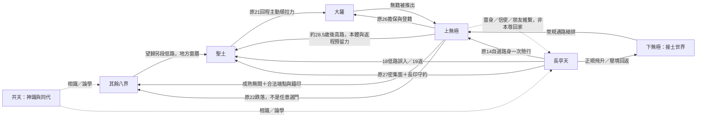

# D119：《劫》世界開放與往返矩陣

> 2026-10-08 年表壓縮（D128）：已依[統一新年表](年表/全書年表與門牆尺度.md)同步。年齡欄改為外界曆齡新值；「原 N」舊篇號保留作索引。「決裂五年」「原18後五年」等時長未改，與新年表段六約一年、空位至多一年衝突，待重定。

> **2026-10-08 作者修正：**現行入口為[九界奪冠、返鄉與上界追仇](九界奪冠返鄉與上界追仇.md)。劫壓倒性第一，賽後領印與自主分路，再返太玄宗、太玄閣、留舟島；費瑜一支襲家，清算下界後追兄長至上界。下文八強敗局、梓葉冠軍／千根首入、故土差一場結算及立即落潮銜接撤用；舊限制本尊不返家亦由本輪覆蓋。舊審查不作新弧通過證明；落潮年月與接引事故待聯排。

> D125 新工作接口：[曉路與未去的玄殿本殿](諸殿時代大脊椎_聖物案與曉路.md)。曉提供局部廢路時段／護行，不開免費跨界；原14首入上無極仍經長亭天路身、文與厄，原15合印候審亦保留。這是道路資源與人生選擇的變化，不另造一個首入世界的時點。

2026-10-04。暫停D118逐地深化，先立全書世界網總架構；D118兩圖與獨立弧保留，並未取消。這份是高層調度，不新定詳細交通機制、不鎖卷數。原二十八篇只作既定節點索引，非未來卷數。

依據：[現行主線](../../設定/05_故事主線與揭露/主線路線總稿.md)、[認知時間線](世界認知揭露時間線.md)、[交通規則](../../設定/01_世界格局/機構與跨界交通.md)、[金丹現行專篇](../卷篇大綱/九界金丹_封傷與八界取材.md)。下列「待開」是尚未設計，不是不存在。

## 開放不只是一個門檻

第一次聽過、第一次見到人或力量、第一次肉身生活、能主動籌備去程、能穩定往返，是五件不同的事。再加第六種：自己沒去，但朋友、雷身與信使讓那個世界一直活在故事裡。

自主是能選擇出發與籌備，不等於免通行、免壓境、免費用、免錨印。反覆往返需要具體來回端點和條件，不因一次成功便宣稱所有地方永久開門。無間成熟增加可用連線，不取消制度與各界拒絕。

九弱是下無極人的偏見俗稱與陸沉的初到生活圈，並非與「下無極其他區」平行的一座正式世界。六域是長亭天內地域；聖土是另一文明天地，非大羅以上一層。

## 世界主矩陣

| 世界／地域層 | 第一次知道／親見 | 首次肉身進入與生活 | 何時可主動籌備前往 | 何時開始反覆往返 | 人物／勢力接口 | 尚待展開的故事 | 主線揭露上限 |
|---|---|---|---|---|---|---|---|
| 長亭天：留舟島、太玄與六域 | 童年生活；早聽六域、上界 | 本土；少年依船、推薦、行路逐地走 | 少年已能選本界旅程，不等於所有禁域能進 | 本界可回訪；飛升後約21–23壓境返鄉、約25護家再返。原14→27之間本尊不再回家，雷身與朋友接續；約35–36由留舟島海眼守約往返、約37立錨後回家 | 陸家、太玄、量水山、文、寇、守界扃天閣 | 六域其他城市與舊友新生活；文工程人生；父母不為主角停轉 | 祖譜與劫痕分次讀，祖先責任不童年揭；回家不是解全古戰 |
| 共天：九界共通神識天地 | 太玄閣童年已有陌生修法與口音 | 神識進入，不列肉身首入 | 持信物與適境條件，自主使用沿既有規則 | 可有神識約見與遞學接口；不能用作肉身交通或跨界即時傳萬卷法 | 書院同代、文的弟子與各界修士 | 論學、同代朋友、私人交流與技藝，尚可用但不包辦旅行 | 不因共享天地便知其古戰來歷與九界全部航路 |
| 其餘八界：文明同代先來，地方後開 | 共天已知他界存在；四院系統對應；18大比真人文明同台 | 原15約25.5–26.5由雷身分路取材：七界入，凌汛未入；各界首次的細日序尚未排 | 成熟無間與已校驗端點、合法通行／壓境準備共同成立；不是18拿第五雷即可 | 可在有目的的返訪與雷身往來繼續開；目前沒有八界都自由往返的既定起點 | 各界大比同代、文共天弟子、守界傳承、蒼梧與聞人錦 | 各界自己的家、工作、族群、技藝、恩怨；不只八味藥副本 | 七印與凌汛上端痕只能支持共同氣機假說，不能直解一統主謀 |
| 下無極初到圈：俗稱九弱時代 | 少年聽上界；大比近看制度與來人 | 未滿20正規飛升，約20開始謀生，歸玄殿澄霄 | 登籍後依身份、工作、船資與區域通路逐地走 | 約20–25日常工作、求學、探險即有多次往來；不待真仙才第一次能旅行 | 玄殿、九鄉會、魯胡、甄、未濟、九渡 | D118橫向生活；工屋、宗門、課業、拍賣、傳承、城市朋友 | D115–117與D118上限照留；只證具體渠道與責任 |
| 下無極其他接土：不是第二次飛升 | 初到上界可聽各地，但知道名字非已見 | 約20–25分批旅行可首次進若干地方；劍原、鶴汀等具體採用次序待開 | 可跟普通貨運、護送與宗門邀約選路；資格與險地各有界線 | 地方工作可形成往返網；上無極之後再訪需聯排，不能假定每年回原 | 斷橋、無燈集、斷雲、千草廬、綴錦、公孫、各族 | 極大量；有完全不接主線的大型篇章，錯潮藥汀先作候選 | 不把地方異常全部翻為曉，古戰完整答案仍遙遠 |
| 上無極：斷峰群及王庭、道場 | 在下無極逐步聽說；見上端來人不等於已知全圖 | 原14約25由古界路路身落至斷峰群 | 路身這次是自選死路，不是常用門。原15之後依身份、錨印與各地資格逐步選旅程 | 在上無極有長期工作、同代與法會；與下無極的常規往返細節待開，不能反覆回路身刷門 | 蒼梧、聞人錦、生、封寒、青璃、道場與十八王庭 | 宗門與王庭生活、同代、金丹後恢復、決裂五年、地方探險 | 原15殘影、18殮錄與航誌分次揭；不一入上無極就能見太宸與全史 |
| 聖土：邊地、諸洲與中心文明 | 18誤入成第一個切身證明；早期名稱知情以既定資料為準，不擅造更早全解 | 18–19低路一年只在邊地；第二次約28.5–31分兩場冒險（原19–20），不再長住 | 約28.5斬我以上可籌備高路，仍要端點與返程預留力；低路要窗口、承載 | 第二次兩年半不是九界無數次通勤；第三次約35–36依密集窗、長印與潮曆守約往返，原27–28接新往來 | 塔、皮、德維、茉、維達、翁蒂娜、園師與主祭、封寒、生 | 極大量；第一次未見的城市、海域、修行文明、落潮後十一年的人生與返訪變遷 | 原8當地版本；19冒籍與私稱；20仙光非長子；27軍令與記門，不一次解全 |
| 大羅／極域 | 書院巡舟三息已親見其作用；大比遺物、14被巡界追是逐步接觸 | 原21約31高路回程主動順拉力進，未登籍被推出；不是完整定居 | 約31能冒險進不代表可合法住；原26約34.5未濟擔保、歸還界屑、正式登籍 | 正式籍增加合法生活與出入可能，實際反覆旅程未開；不等於從此各禁地免費進 | 太宸、未濟、蒼梧舊約、巫峙、祁舊園與居民 | 幾乎未開的居民、機構、道場與未知天地；終局之外不先填滿 | 21附冊缺口，26長子副本與封過兩次；正式入也非一次全答仙道 |
| 跌落後返訪：驤鳴、碎錦原等舊地 | 原15已分路見若干界；驤鳴自己的首入界次見下表 | 原22約32沿路身外段墜驤鳴；23–24重修再上與回碎錦原 | 當下承載與重新取得修為決定路，不能以往真仙資歷略掉困難 | 不是開新地圖，而是回熟地重新過日子；復修後可恢復部分舊連線 | 文的手法、地方孩童、聞人錦、公孫、太素、嵇與婁 | 舊友老去、朋友已選別路、技法重練、債還活著 | 23古骨取痕，24多雙手與決裂，25三刻，不靠跌落自動獲全知 |

表中年齡是宏觀段，具體年份依現行年齡線。大羅正式登籍只保原26的約34–35區間，不自創某一歲生日。

## 八界分開看，不用一格冒充全開

共天／書院／大比的分層知道沿主表；以下首入專指陸的具身，包括有共同本源的雷身，與本尊在旁續命分清。

| 界 | 最早具身與自主入口 | 重複連線狀態 | 人物／勢力接口 | 尚待展開／揭露邊界 |
|---|---|---|---|---|
| 懸岳 | 原15雷身取材入境，具體先後待排 | 合法端點可作後來返訪方案，尚非反覆遊山已發生 | 山與錨城當地人、守界接口 | 遊山、工匠、季節去留；深淵之異不必解古戰 |
| 蒹葭 | 原15雷身取材入境 | 有藥材與人物往來接口，不等於自由採全界 | 盛芷、荇娘、藥童、藥署 | 出圃後的人生與承藥文明；非生專屬藥庫 |
| 千根 | 原15雷身取材入境 | 樛萌等同代可以形成再訪，不先定本尊定居 | 梓葉、樛萌、接木家與守界者 | 接木、成人、生計；不能直接把生物接木變成原26聖土副本技術鑰已懂 |
| 霜明 | 原15雷身取材入境 | 留影與人情可接再訪，次序待開 | 留影師與當地傳承 | 私人記憶、凍光、技藝；影不是天然鐵證 |
| 望歸 | 原15雷身取材入境；原17約33壓境下望歸遇塔〔第17篇已撤出，時點待重定〕 | 原22一具守口傳七家渡口、按期合印後在下無極等；雷身不是本尊自由私入 | 塔姆林、越裳、口傳七家、玄殿碧梧擔保 | 家庭、通譯、窗曆；本段不能把十四年等人改成全五人到場 |
| 昏曉 | 原15雷身取材入境 | 後來可選再訪故事，尚未設常年線 | 西四界既有地方人物與守界傳承，新接口待選 | 大量生活未開；不為湊故事送新雷 |
| 凌汛 | 原15赴上端取材／求通行，拒入；不是首入 | 自主選擇去申請不等於獲准。真正入界與首次再訪待定 | 津署、尤擷與通行方；不把拒絕全推一個陰謀 | 可長出拒入後的地方視角；八痕中這一痕不是下端入界拓印 |
| 驤鳴 | 原15雷身取材入境；原22約32本尊跌落是另一種首入生活 | 重修長期住下與普通工作，復修後連線再開 | 雷池雜工、文教過的孩子與既有在地人 | 不是全世界等陸；早取材不能提前拿走解除跌落的萬能辦法 |

上表不新定八界材料明細或金丹百日順序；往返若需新增門、印期與端點，先在故事具體用到時聯排。大比同代、共天相識與當地居民都能先過自己的人生，不必等陸第一次來才出生。

## 世界網：連線會變，也會斷

這是主角人生中的已定與待聯排連線，不表示所有雙向箭頭都有同等安全。原14之後本尊長期不回長亭天，家仍由雷身、朋友與訊息在場；原21蒼梧舊約造成離開，量界支援與關係會斷。原22修為跌落可讓過去可用的連線暫不可用。世界網不是只增不減的遊戲解鎖表。

## 往後開故事時，用一個回訪問題

「上次離開後，這裡的人做了什麼？」再問誰能讓陸回來、誰不願他回來、他為什麼想留下或離開。拍賣、秘境、課業、婚事、做工、師長、敵人與奇景都可以由當地人發端。新世界可大開，舊世界也能一直新生。

每次新增一條跨世界連線，核四件事：誰真的到了；去程與回程各靠什麼；哪個資格／代價依然有效；知情只增加到哪一步。資料由信使送到不算人物到，雷身到不冒稱本尊住，低路或跌落成功不冒稱已獲穩定高路。

## 下一步的架構層級

D118的橫向種子先停在候選，不繼續擴錯潮藥汀。用本矩陣確定下一個值得開的生活節點與已有連線，再選一條地方大故事。原20第二次聖土兩場（舊「二十七年長住」已依 D128 刪）、原18後五年（時長待重定）與下無極其他接土都還有巨大容量，不能為了維持線性升級把這些回訪與並行人生刪掉。

不把所有地域的首入細節一次補齊；待開的格就留待開。終局仍守第十雷、立錨與回家，不以一張宏圖提前定每條路的秘密。
