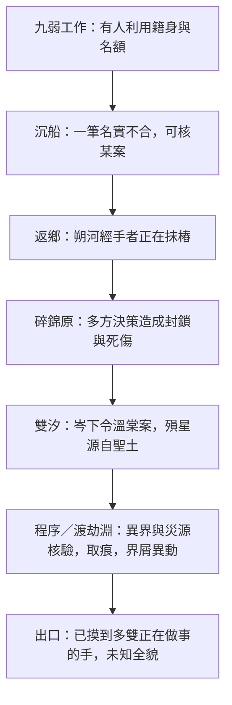

# D118：九弱大，但完整答案很遠

2026-10-04。配[地域與橫向人生圖](九弱地域與橫向人生圖.md)，規範原第9–14篇間新增故事的知情邊界。依現行主線揭露表，不把作者知道的連線塞進陸沉腦中。下面是大綱審稿工具，不是正文逐條報告。

## 揭露上限圖

各格是不同案的已證事實，不是「證明同一幕後」的六級拼圖。圖沒有通往曉、公主、太宸與古戰答案的箭頭。

| 階段 | 陸最多可知 | 仍不能由此推出 | 新增故事怎麼停 |
|---|---|---|---|
| 工作與地方生活 | 魯晏收費、甄轉工、某份契不公；玉壺救人收屍表面真有功 | 魯晏是曉、甄奉古戰主謀令、玉壺全面活取根 | 收在本地損失、殺局、契款與誰還活著 |
| 沉船頂名 | 一筆遞書吏名下氣機不合，原主家名額受損；經手配額有朔河與買賣渠道 | 所有船都假、晁全知、商氏家族集體下令、完整代理鏈 | 還回此案名額，公開來源；不能留一份可查全部秘密全錄 |
| 壓境返鄉 | 抹樁者來自朔河；尺中有遮蔽輪廓；祖譜真少字 | 空白就是藏曜、陸家先祖殺人、祖譜能神識復原 | 拿到有限帶令痕，敵人確有一部分逃掉或銷掉 |
| 碎錦原 | 岑升級、玄闕拒撤、傭隊被差別放棄；同歸有人記衰退、歸一看似能修復 | 「同一隻手」已證、同歸全支派目的、這些人都是曉 | 災損與去留是真的；數據如何挑過留第25篇 |
| 雙汐 | 藏曜對尺空白，翟氣機對船錄，岑溫棠命令成立；商未下那道令；裴說骨屬長子 | 商完全無罪、長子殺公主、公主真相、骨能回放古史、奸細罪已坐實 | 溫棠案結，新核驗開；知道長子存在不等於懂其行程 |
| 程序與渡劫淵 | 自身接痕可疑；骨有整齊取痕；界屑吞入本源被儀器記錄；災源案卷與追界程序 | 玉壺就是古戰屍骨收用者、取痕證全史、界屑指向太宸、厄講前世 | 接痕第13、取痕第14、古骨同源第23分開；不提前解乾淨醫門全部假象 |

太宸的名字可以按既定世間常識聽過，不能故意說世界不知道帝名；禁止提前知道的是他與長子、封界決策的私人真相及責任。烏蘅私稱、長子自請為質、祁承朔布局、撤護持、封過兩次與完整古戰原因，都留各自既定來源，不靠新增拍賣古經買到。

## 人知道多少，與讀者知道多少

- 地方事件：當事人知道自己的錢、地、師門與仇，不增隱藏指揮者。
- 利益合作：收買古物者可只知品項、價與交付點；不是先宣稱曉，再硬說他不知道。
- 代理人：知某個僱主或代號與交貨條件；不能一搜魂便補出所有層。
- 正式行動者：若正式採為曉，最多知自己的任務與可用資源；身份與局部成果可以真揭，不拿失憶或臨死滅口保每一份情報。
- 歷史知情者：本期只可擦邊，不能從缺頁便約到全知仙王。高階人物不是因主角問了就把自己知道的歷史全說。

視角外可以讓讀者看到一次明確的局部行動，陸未必知。不能寫全知旁白先報古戰真因，再假裝讀者仍在推理。新增地方伏線也可以回收到地方人物，無需連古戰才值得寫。

江停燈、唐渡白、黎照野、邴初沿既有Actor方案：正式組織歸屬仍未定，本輪不自動把三人編成曉幹部；黎受查邊界也不取消。若出場，救人、斷路、改人的成果與越線都依他們自己的目標。對方幫過陸不等於洗掉風險，也不靠一次黑袍旁白宣判終極反派。

岑越更不能為了限知被改成不知道自己下令。溫棠案是他的選擇，與商的有限危機合作也有自身利益；他不知道完整古戰，不等於不知道當代行為。供述可揭他的令，不能揭他根本未接觸的曉或公主。

## 故事節奏與停止追查的理由

橫向故事不強制每卷留一個被挖名或航圖空白，那會把「純地方」重新變成查案。許多地方可以正常，奇景可以沒有解。主線偶爾刺入生活，必要時陸能查就查，不故意無理由放下已可救命的線索。

停追只能因真實限制：資料核驗尚未到期、持有人在別處、合法路程與資格不合、眼前人要先救、自己傷勢不能走。對手在此期間照樣行動，有一部分成果真的銷掉，不能當主角去玩就全體休假；但他們也不跨整個下無極無處不在地追殺。

九弱出口是「有人正在抹東西、利用名字與放棄活人；我知道其中幾人，仍不知規模與來由」。系統性可以是他有證據的懷疑與若干渠道，不足以證明所有事件同源。後段第24篇「同一隻手不存在」照留，不能被本輪新的統一幕後說蓋掉。

## 新故事採用前的四問

1. 當事人是想拿資源、守地、報仇，還是確有局部暗任務？不能最後才翻成曉。
2. 陸用什麼來源得知？來源本人真有資格知道嗎？
3. 這個結果解決的是哪一個地方問題，有沒有不相干的好消息與新朋友？
4. 是否提前完成了第18、20、23、25、26、27篇才有的揭露？若有，先改新故事，不回改全部舊鎖。
