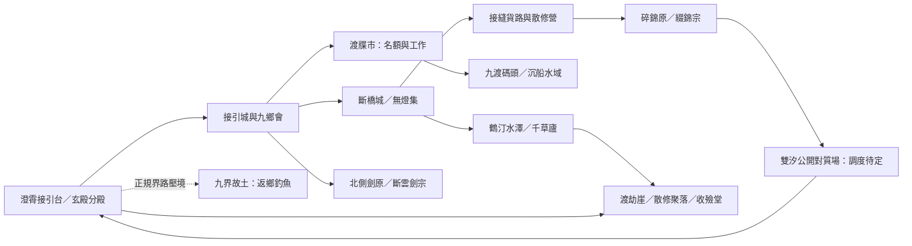

# D118：九弱時代的地域與橫向人生

> **2026-10-08 全段重審狀態：舊生活擴寫任務停止排期；世界與人物資料僅作重開參照。**以下保存舊稿與局部成果，舊「下一輪／已通過」不作現行排期。現行裁決見[全段重審與重開](九界後全段重審_總裁決與重開順序.md)，八界救生原案豁免。

2026-10-04，作者指定的擴寫方向。原第9–14篇是約二十至二十七歲的縱向骨架，不是六篇就能裝完的世界；D115、D117照留，以下在節點間長出人生。20–30卷級與全書70–100卷級只記容量想像，撤回45–50卷作規劃上限，不定最終卷數、不排30卷清單。

**九弱是修士被叫的俗稱，本圖不是一個叫九弱的正式國度。**地域是下無極約上千片接土中的可行旅程，不能把九庭俗稱當九張地圖。已有位置依[下無極勢力](../../設定/01_世界格局/勢力/下無極勢力.md)，新通路與故事標工作提案。

> D120修正凡人換皮風險：下列拍賣、運獸與藥汀核心改為只有修仙世界能發生的條件。其他種子仍待凡人替換測試，不宣稱全表已合格。D119高層矩陣繼續優先，不恢復逐項深化。

## D123 接續

作者已指定恢復開荒，不等待 D121 紅項清零。[七個大型故事候選](二十至二十七歲_七個大型故事候選.md)由本圖種子與新地方欲求篩出四個工作選用、兩個保留、一個不採。D119／D120 暫停逐地深化是歷史工作安排，現由 D123 覆蓋；本圖制度與生活種子的紅債仍留，後來碰到再修。

## 地域關係圖

這是生活節點與通路類型圖，不是比例尺地圖；沒有憑空確定東西距離、航期與直達門。

箭頭表示可籌備的行路方向，主角要工作換船資、等貨運或沿接土走，不等於免費瞬移。沉船、碎錦原有主線，不代表所有去碼頭或原上的人都在辦案。

## 在哪裡，過哪種日子

| 生活區 | 已有的世界 | 可長成的獨立故事 | 取得與改變 | 與暗線關係 |
|---|---|---|---|---|
| 接引城、玄殿與九鄉會 | 弟子籍、互助、薦工、課業 | 九鄉會修一座共用工屋；一批人想留，一批人攢返程費，龐渡不能替所有人定用途 | 手藝交換、同鄉分歧、可長期回去吃飯的地方 | 九鄉會既有蔚北伏根不擴為每件事背後主謀；工屋本案不接他任務 |
| 斷橋城與無燈集 | 道脈地段、收費、事故回收物 | 候選殘器易主便少一段，去向無人知；某宗祖師八百年前畫像握的卻像今日才出土的殘器。競價者想驗圖，不只修器，劫不能據此證時間倒流 | 沒買到也有見識；買到須耗工與材料，失敗記錄不是必贏神器 | 純地方事件，不在器內藏古戰名單 |
| 鶴汀水澤與千草廬 | 藥源、醫修、不同族群的生活 | 大型候選「錯潮藥汀」：古生靈夢落成藥，本季錯路使人夢入陌生人生；有人爭七息奇藥，有人守住自己醒念與幼靈 | 行水身法、丹材辨識、朋友、真實對抗與自己能做的範圍 | 完全無關公主、曉、九界陰謀，見獨立弧 |
| 北側劍原與斷雲 | 分家劍宗、收徒、同代 | 公開適境試劍與護路演法：殷長策要守自己劍宗的名，封寒想親試別人的承法；陸可參有限項目或缺席 | 成熟適境傳承、受控場資格、失敗與下次可練的技法 | 不以賽果分九界政治權；不突然給瘋轉鐧成品 |
| 接縫貨路、散修營 | 傭修、船期、休工與維護 | 一次運獸：仙獸沿乾涸三千年的天上舊河仍在游，貨路今季正穿過那段。河無水卻仍牽舟與法力；普通改道不足，需先試修士可用的脫勢法，不定河為何存在 | 器材、運輸交情、能真正使用的護身技藝 | 私人契約與生境利益，不是曉安排獸潮 |
| 九渡碼頭與外部採域 | 貨運、普通乘客與承運風險 | 合法探險團進一座季開小境；一位前輩真的教劫基礎神魂穩念，另一隊只爭採權；得一卷不完整但可練的殘法 | 權限、材料、初學不合再改；不能一次發成熟活修 | 探險與沉船是兩件事；此境不掉翟七第二份證物 |
| 碎錦原日常區 | 綴錦宗、傭隊、住民、公孫試根 | 日常可先有輪值演法、修灶、交易、搬家；地方敵人爭工價與地盤，有人只貪一季租金 | 維護術與同行生活先成立，後來失去才有重量 | 岑危機是縱線刺入，不能反認所有住民均是他的棋 |
| 渡劫崖聚落、醫棚 | 收費護道、渡劫者、葬者與名字 | 幫一個散修辦完不屬於陸的渡劫準備；他成功後真去別處。也可有醫棚的藥市與護具競價 | 正常成功、朋友離開、技藝與一份平凡好消息 | 之後取痕、歸墟揭露依原節點；不每個死人都是被玉壺害死 |

女人與異族要以自己的目的入場，不列一排對陸有好感的人：生的碧梧、聞人錦的招攬、蘇映真的同行與新地方女修各有工作、主張、朋友與拒絕。允許相處有吸引與私人情緒，陸生主感情線照留，不擅改為後宮。

## 哪些空間能容納長故事

- **飛升到沉船公開之前（約二十至二十一）**：玄殿適境學習、斷橋拍賣、鶴汀三月生活、採境可以串成多種日子。魯晏與胡湛關係在其間累積，不能每段都加一宗壓契。急迫的救胡湛不可插旅遊。
- **返鄉回上界到碎錦原爆發之前（約二十二至二十三）**：帶令線有待核、需等人在上界現身，他仍要接活、練法、交友。地方運獸與試劍可在此，不用每故事撿一份新線索。
- **碎錦原後到雙汐之前（約二十三至二十四）**：留原雷身有監看，本尊仍需生活；先完成傷者與欠款的善後，再有短旅。岑也在拆自己的線，不強造一年全無動作；對質所需觀測時段未到，不代表陸坐等。
- **程序未決到渡劫淵與路身（約二十四至二十七）**：任務與修行有資格限制，不再自由參全境盛會；短程日常、可承攬採境與朋友的事仍能寫。沒有正規護持的渡劫準備、修行至天神與後來鏽落有年月，不是七個連續轉場。

各段不必全部採用，也不能為20–30卷把一年硬塞幾十次秘境。正式擴寫若時間容量不足，先辨哪些故事可跨人物並行、可留返訪；沒有作者確認不拉長固定年齡線。

## 橫向故事的最低完成度

每個要保留的大故事都要有自己的人、追求、第一次失敗、選擇、代價、結果與後來日常。主線刪掉仍能成立，才叫橫向人生。不能只用「參拍賣、進秘境、交朋友」三行充當內容。

敵人分類以事件為單位，目標至少六至七成衝突與曉無關；這是防收束原則，不假裝目前已有二十五卷可精算。採用後追蹤每場實際責任，不能用六個路人對上三個Boss湊比例。不倒揭地方敵人都是外圍，也不將未知景觀統一古戰化。
